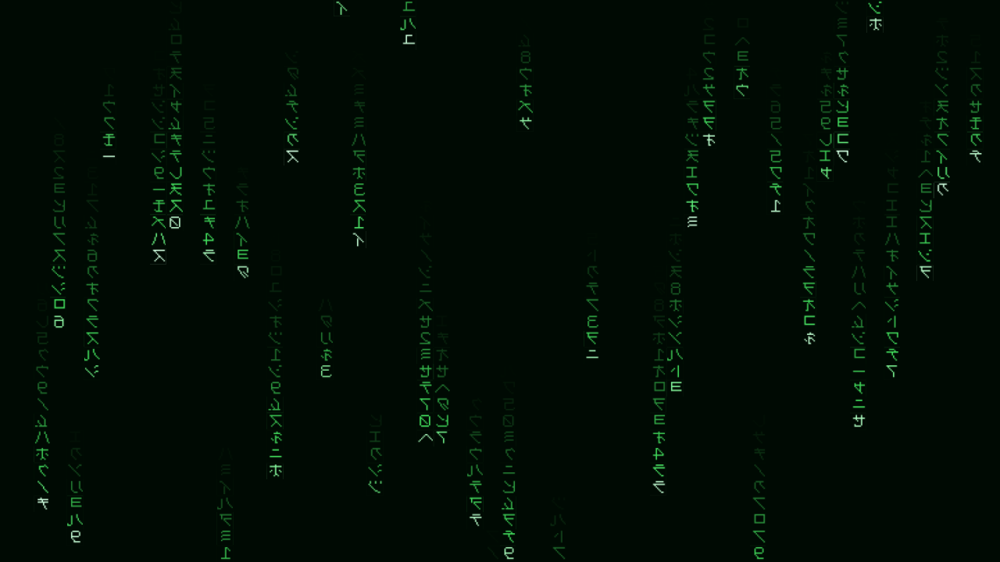
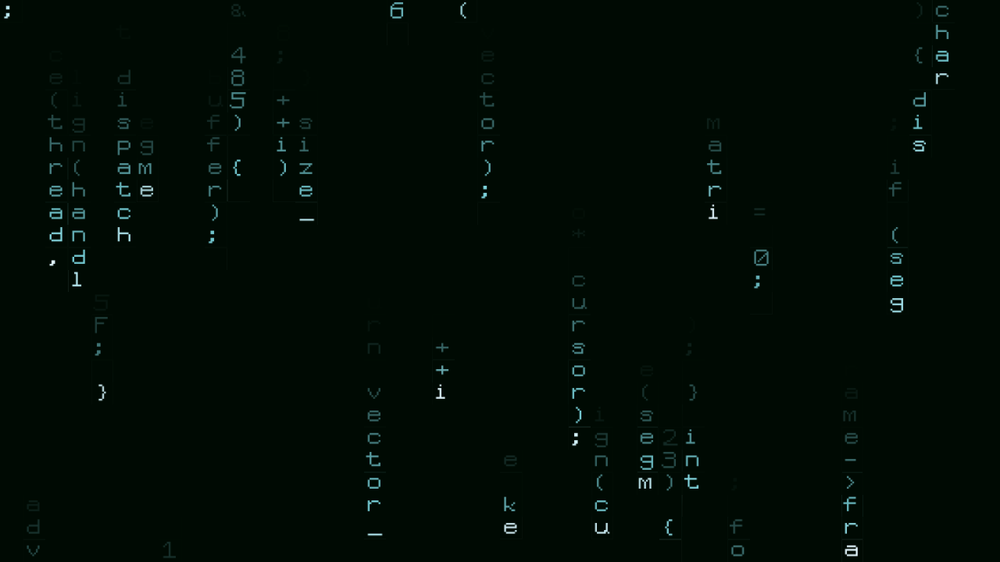
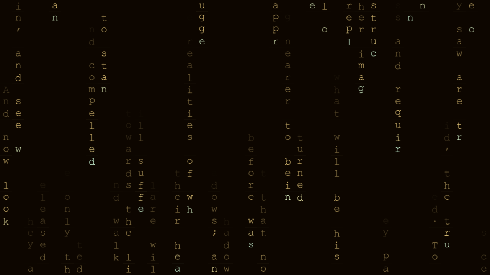
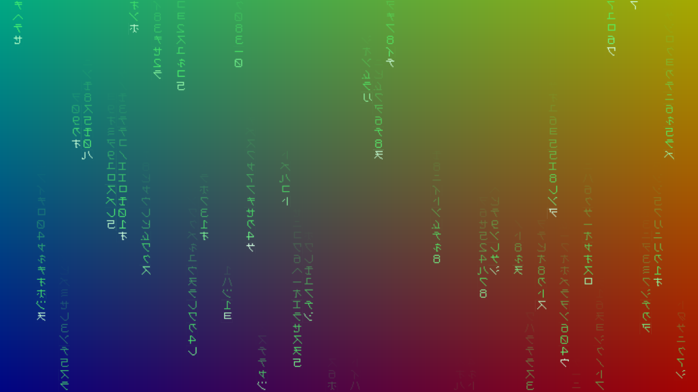

# Downpour

> **AI-assisted project.** This codebase was created with [Claude](https://claude.com/claude-code)
> (Anthropic), directed and reviewed by a human author. The rain is verified
> numerically by an offline harness that drives the real plugin class in a
> headless GL context: it compares ~40,000 rendered cells against an independent
> C++ implementation of the same maths, and separately renders a book, reads the
> characters back out of the pixels and reassembles the text (see
> [Status](#status)). It has **never been loaded into Resolume** — only compiled,
> rendered and measured offline. Check it in your own rig before trusting it in a
> show.

Falling columns of characters — digital rain — for [Resolume](https://resolume.com)
Arena and Avenue, as a pair of FFGL plugins.

**Video:** [What it does, in 45 seconds](https://www.youtube.com/watch?v=Sdvmpz_GiTo)



<sub>The default: mirrored half-width katakana, green on black, sixty columns.
Rendered by `dptest`, the offline harness.</sub>

## Try it in your browser

**<https://downpour-demo.stoatworks-labs.com>**

Not the plugin — the GLSL from `source/Shaders.cpp`, copied across unedited and run in
WebGL2 over clips generated in the page, with the parameters this plugin's
constructor declares and the conversions its own code applies. No install, and
nothing you load leaves your machine.

Both bundles are there — the source and the effect, compiled from one shader the same two ways this repository builds them. The drawn face and the four public domain passages come straight out of `source/GlyphData.cpp` and `texts/`.

It is a port, so it is not evidence about the plugin: a browser is not Resolume,
GLSL ES 3.00 is not desktop GL 4.1 core, and nothing on that page measures
anything. The page says all of that itself, in a disclosure at the foot. The
numbers worth trusting are in [Status](#status) and come from the offline
harness in this repository.

<!-- downloads:start -->

## Download

**[v0.2.0](https://github.com/stoatworks-labs/downpour/releases/tag/v0.2.0)** — prebuilt for macOS and Windows. Pick your platform:

<details>
<summary><b>macOS</b> — Universal (Apple Silicon + Intel)</summary>

| Build | Download | Size |
| --- | --- | --- |
| Universal (Apple Silicon + Intel) · .dmg disk image | [`downpour-0.2.0-macos-universal.dmg`](https://github.com/stoatworks-labs/downpour/releases/download/v0.2.0/downpour-0.2.0-macos-universal.dmg) | 962 KB |
| Universal (Apple Silicon + Intel) · .zip archive | [`downpour-macos-universal.zip`](https://github.com/stoatworks-labs/downpour/releases/latest/download/downpour-macos-universal.zip) | 603 KB |
| Universal (Apple Silicon + Intel) · .zip archive (OpenFX — Resolve, Vegas, Nuke) | [`downpour-ofx-macos-universal.zip`](https://github.com/stoatworks-labs/downpour/releases/latest/download/downpour-ofx-macos-universal.zip) | 378 KB |

</details>

<details>
<summary><b>Windows</b> — x64</summary>

| Build | Download | Size |
| --- | --- | --- |
| x64 · .exe installer | [`downpour-0.2.0-windows-x86_64-setup.exe`](https://github.com/stoatworks-labs/downpour/releases/download/v0.2.0/downpour-0.2.0-windows-x86_64-setup.exe) | 279 KB |
| x64 · .zip archive | [`downpour-windows-x86_64.zip`](https://github.com/stoatworks-labs/downpour/releases/latest/download/downpour-windows-x86_64.zip) | 343 KB |
| x64 · .zip archive (OpenFX — Resolve, Vegas, Nuke) | [`downpour-ofx-windows-x86_64.zip`](https://github.com/stoatworks-labs/downpour/releases/latest/download/downpour-ofx-windows-x86_64.zip) | 126 KB |

</details>

All builds, checksums and release notes: [github.com/stoatworks-labs/downpour/releases](https://github.com/stoatworks-labs/downpour/releases).

macOS builds are signed and notarised and open normally. The Windows builds are unsigned, so SmartScreen warns once.

<!-- downloads:end -->

## OpenFX — Resolve, Vegas, Nuke, Natron

The same effect also builds as an OpenFX plugin, so it runs in DaVinci Resolve
(Edit and Color pages, and Fusion), Vegas Pro, Nuke and Natron. It is
the identical rain — the OpenFX build calls the same Rain.cpp the shader is measured against, and one bundle carries both plugins: the generator and Downpour Over.

Grab the `downpour-ofx-*` zip for your platform from the release and copy
`Downpour.ofx.bundle` (both plugins are in the one bundle) into the standard OpenFX folder, then restart the host:

```
macOS    /Library/OFX/Plugins/
Windows  C:\Program Files\Common Files\OFX\Plugins\
```


Both plugins are in every download — drop them into
`~/Documents/Resolume Arena/Extra Effects` (or the Avenue equivalent) and restart
Resolume. **The macOS build is not notarised**, so the first launch needs a
right-click → Open, or a trip through System Settings → Privacy & Security.

## Two plugins

| | |
| --- | --- |
| **Downpour** | A *source*. Draws rain over its own background, on its own layer. |
| **Downpour Over** | An *effect*. Draws the same rain over the incoming clip, so the controls live on the clip rather than a layer above it. |

Both are the same code with one flag different, which is what stops them drifting
apart.

## It reads whatever you give it

The rain does not know the difference between an alphabet and a book. Both are a
list of characters; the only question is whether it picks from them at random or
reads them in order — and the Source control decides that, because the two
combinations it rules out are both traps. Scattering a novel is an expensive way
to make noise, and sequencing a six-character alphabet is a marquee that repeats
every six cells.

| | |
| --- | --- |
|  |  |
| **Code** — a token grammar, not random characters. What makes text read as *code* at rain speed is its punctuation density: brackets, semicolons, arrows, hex literals and camelCase. Prose has almost none of them. | **A document, played out in order.** Consecutive characters down a column, consecutive columns across the frame, advancing by a screenful each time the drops recycle — so the text genuinely streams past rather than being sampled from. |

**Junk** draws from katakana, katakana with digits, hex, binary, ASCII, digits or
latin. **Four public domain works** are built in — *Alice in Wonderland*, Plato's
allegory of the cave, Hamlet's soliloquy, and Descartes on methodical doubt and
the cogito. Or type your own text, or point it at any `.txt` on disk.

## Any font, and it cannot leave you with a blank frame

Pick from the fonts installed on the machine, or point it at any `.ttf`, `.otf`
or `.ttc`. There is also a bitmap face drawn for this project, and it is the
floor rather than a placeholder: **fallback is per character, not per font.**
Choose a font with no katakana and you get your font for the latin and the
built-in face for the katakana, instead of a grid of empty rectangles.

That matters more than it sounds. A composition stores a font *path*, and the
next machine is a different rig in a different country. A plugin whose picture
depends on a path that may not resolve needs somewhere to land, and landing on a
blank frame in front of an audience is not a defensible answer. Downpour also
writes the resolved **family name** into the composition alongside the index, and
prefers the name when the two disagree — names survive the trip between machines;
dropdown positions do not.

## Over your footage



<sub>`Downpour Over` on a test gradient, with the plugin's own background at 35%
opacity veiling the clip beneath.</sub>

## Nothing about it drifts

A cell is a **closed-form function of its column, its row and the host's clock**.
There is no simulation state anywhere: no feedback texture, no ping-pong buffer,
no "previous frame".

That is not an implementation detail, it is the feature. A state-based rain
advances one frame at a time, so its speed is whatever the frame rate happens to
be — and Resolume's frame rate drops when the show gets heavy. This one runs at
the speed you asked for whether the host is managing 60 fps or 20, looks
identical at 720p and at 4K, and can be scrubbed to any point without playing
what came before.

## Controls

**Rain** — Speed, Direction (down, up, right, left), Columns, Trail, Density,
Mutation, Fade, Seed. Mutation scales with Speed, so winding Speed down calms
the whole picture — glyph churn included — rather than leaving a shimmering
wall behind slower heads.

**Text** — Source, Characters, Custom Text, Text File, Mirror Glyphs.

**Font** — Font, Font File, Glyph Size.

**Colour** — Text colour and opacity, Head colour and boost, Background colour
and opacity, Glow.

**Output** — Mix (the effect variant: how the rain sits over the clip).

**Tempo** — Sync (Free, Beat, Bar). Free runs Speed in rows per second on the
host's clock. Beat and Bar lock the rain to Resolume's BPM: Speed becomes rows
per beat or per bar, and each interval's travel is eased in hard at the front,
so the rain visibly kicks on the grid rather than merely matching its average
speed to it.

**Audio** — Audio (an FFT input: pick an audio source on it in Resolume) and
Audio Level. Each column is gated by its own slice of the spectrum, low
frequencies at the left of the frame, so the bass end flares on the kick and
the treble end shimmers with the hats. This is per-column: Resolume's own
per-parameter audio link can pump one slider, but it cannot give sixty columns
sixty different bands. FFGL only — OFX hosts have no audio analysis.

The head colour is worth finding early. The bright leading character is most of
what reads as digital rain rather than as a screensaver.

## Status

Verified offline, never in a host. `tools/verify.sh` runs:

| Check | What it proves |
| --- | --- |
| `--rain` | The shader's arithmetic against an independent C++ implementation, over ~40,000 cells: every direction, three resolutions, mutation on and off, and a drop that has wrapped. Worst disagreement ~3e-6. |
| `--readback` | A rendered frame of *Alice* read back character by character out of the pixels and reassembled — **100%**. Covers UTF-8 decode, atlas build, slot mapping, the stream texture and the glyph fetch. |
| `--font` | The drawn face's own invariants, and where every glyph in the atlas came from. |
| `sweep.py` | All 30 controls move the picture. This is the only thing that catches a GLSL uniform whose name does not match the C++, which is silent everywhere else. |
| `lipo` / `nm` | The macOS bundles are universal and export `plugMain`. |

Nothing here has been run in Resolume, on real footage, or against a projector.

## Building

```bash
git clone --recursive https://github.com/stoatworks-labs/downpour
cd downpour
cmake -B build -DCMAKE_BUILD_TYPE=Release
cmake --build build
cmake --install build     # into ~/Documents/Resolume Arena/Extra Effects
```

`CLAUDE.md` is the command reference. `AGENTS.md` is the design rationale and the
list of traps — read it before changing the rain maths, the atlas or the font
handling.

<!-- attributions:start -->
This project is built on other people's work — see [ATTRIBUTIONS.md](ATTRIBUTIONS.md).
<!-- attributions:end -->

## Licence

MIT — see [LICENSE](LICENSE).

The glyphs in `source/GlyphData.cpp` are drawn for this project and are MIT along
with everything else. Downpour deliberately ships **no** recreation of the film's
typeface: the well-known fan font is free for personal use only. Mirrored
half-width katakana is a technique rather than something anyone owns, so the
built-in face draws its own, unmirrored at their real code points and flipped at
sample time.

The four built-in passages are public domain in the United States, taken from
Project Gutenberg with the header, footer and trademark stripped — see
[texts/SOURCES.md](texts/SOURCES.md).

Vendored: the [Resolume FFGL SDK](https://github.com/resolume/ffgl) and
[stb_truetype](https://github.com/nothings/stb) (public domain).

This project is not affiliated with, endorsed by, or connected to Warner Bros. or
the makers of *The Matrix*.
